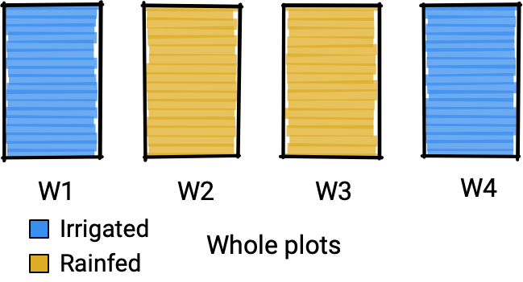

```{r, include = FALSE}
current_file <- knitr::current_input()
basename <- gsub(".Rmd$", "", current_file)

knitr::opts_chunk$set(
  fig.path = "images/",
  fig.width = 6,
  fig.height = 4,
  fig.align = "center",
  fig.retina = 2,
  echo = TRUE,
  warning = FALSE,
  message = FALSE,
  cache = TRUE,
  cache.path = "cache/"
)
```

class: middle center hide-slide-number monash-bg-gray80


```{r, include = FALSE}
library(tidyverse)
library(colorspace)
library(nullabor)
basename <- ifelse(exists("basename"), basename, "slide")
pdflink <- rmarkdown::metadata$pdflink
titlebgimg <- ifelse(is.null(rmarkdown::metadata$titlebgimg),
                     "images/bg-01.png",
                     rmarkdown::metadata$titlebgimg)
```


.info-box.w-50.bg-white.f3[
These slides are viewed best by Chrome or Firefox and occasionally need to be refreshed if elements did not load properly. See <a href=`r pdflink`>here for the PDF <i class="fas fa-file-pdf"></i></a>. 
]

<br>

.white[Press the **right arrow** to progress to the next slide!]


---

count: false
class: title-slide
background-image: url("`r titlebgimg`")

.w-85[
# .f1[`r rmarkdown::metadata$title`]
]

<br>

<h2 style="font-weight:900!important;">`r rmarkdown::metadata$subtitle`</h2>

.bottom_abs.width100[

Presenter: *`r rmarkdown::metadata$author`*

.f3[
`r rmarkdown::metadata$department`

<i class="fas fa-envelope"></i>  `r rmarkdown::metadata$email` &nbsp;&nbsp;<i class="fab fa-twitter"></i> @statsgen

<i class="fas fa-calendar-alt"></i> `r rmarkdown::metadata$date`

<br>

]]


---

class: fullscreen

.flex.h-100[
.w-30.monash-bg-blue.white.pa3[

<br>

.f1[**Emi Tanaka**]


*Lecturer in statistics*  
Monash University

.f3.lh-copy[
<i class="fas fa-envelope"></i> emi.tanaka@monash.edu  
<i class="fab fa-twitter"></i> @statsgen  
<i class="fab fa-github"></i> emitanaka  
<i class="fas fa-globe"></i> emitanaka.org
]

]
.w-70.pa3.f1[
.monash-blue[<i class="fas fa-book-open"></i> **Table of Contents**]

.f2.pa3.lh-copy[

.box[1] Introduction to Visual inference  
.box[2] The Grammar of Experimental Designs  
.box[3] Main interests and contributions summary

{{content}}

]

]]


--

<div class="border-box monash-bg-blue2 white f3">

These slides can be found at:<br><br>
<center>
<i class="fas fa-link"></i> <a class="white"  href="https://emitanaka.org/slides/DARE-LOOP">emitanaka.org/slides-DARE-LOOP</a></center><br>
These slides are made using the xaringan R-package, powered by remark.js, and all the source code to reproduce these slides are available at:<br><br>
<center><i class="fab fa-github"></i> <a class="white " href="https:://github.com/emitanaka/slides-DARE-LOOP">github.com/emitanaka/slides-DARE-LOOP</a></center>

</div>

---


class: transition 

# Introduction to <br>.yellow[Visual Inference]


---

# .yellow[Assessing data plots] <i class="fas fa-gavel"></i> Case study with residual plots .f4[Part 1]

.flex.h-100[
.w-60[

* Model diganostics are cruicial if inferences are to be made on the model


{{content}}

]
.w-40[
```{r resplot, echo = FALSE, fig.height = 5, fig.width = 5}
set.seed(1)
df1 <- tibble(id = 1:100) %>% 
  mutate(x = runif(n(), 0, 10),
         y = 1 + 2 * x +  sin(x) + rnorm(n()))

lm(y ~ x, data = df1) %>% 
  broom::augment() %>% 
  ggplot(aes(x, .resid)) +
  geom_hline(yintercept = 0, color = "gray", size = 1.2) +
  geom_point() + 
  theme_bw(base_size = 18) +
  labs(title = "Residual plot",
       x = "Covariate",
       y = "Residual") +
  theme(plot.title.position = "plot",
        plot.title = element_text(color = "#006DAE"))
```

]]

--

* A common model diagnostic is to look at residual plots and to search for any patterns
{{content}}
--

* If there is a pattern, it is indicative of a misspecified model
{{content}}
--

* **Do you see a pattern on the plot in the right?**

---

# .yellow[Assessing data plots] <i class="fas fa-gavel"></i> Plots are also statistics

.flex[
.w-70.pa3[
* In statistics, we are careful in assessing __*numerical* statistics__ by taking into account its uncertainty 
* BUT we are _quite informal in assessing plots_
* Data plots are also statistics 
* **_Data plots ought to be treated with the same rigour as numerical statistics_**
]
.w-30.pa3.center[

Frequentist framework


]]

---

# .yellow[Assessing data plots] <i class="fas fa-gavel"></i> Case study with residual plots .f4[Part 2]

* **Hypotheses**: $H_0$: $e_i \sim NID(0, \sigma^2)$ vs. $H_1$: not $H_0$
* **Assumptions**: $\sigma^2$ is known and is equal to maximum likelihood estimate
* **Test statistic**: Residual plot
* **P-value**: ???

--

* We can use the approach by Buja et al. (2009):
.f4[
1. Strip away context from data plot so there is no bias
2. Generate the null data under $H_0$
3. Create $k-1$ "null plots" by using visual encoding choice as data plot but using the null data
4. Embed the data plot in a random position within the lineup of null plots
5. Ask $m$ observers which plot is the most different in the lineup and let $X$ be the # of observers who detected the data plot
7. Assuming observers are independent and equal visual ability, $X \sim B(m, 1/k)$.
8. And the P-value (or "see-value") is given as $P(X \geq x)$.
]


.footnote.f5[
Buja, Andreas, Dianne Cook, Heike Hofmann, Michael Lawrence, Eun-Kyung Lee, Deborah F. Swayne, and Hadley Wickham. 2009. “Statistical Inference for Exploratory Data Analysis and Model Diagnostics.” Philosophical Transactions. Series A, Mathematical, Physical, and Engineering Sciences 367 (1906): 4361–83.
]

---

# .yellow[Assessing data plots] <i class="fas fa-gavel"></i> An example lineup

.flex[
.w-70[
Which plot looks the most different to you?

```{r resplot-lineup, echo = FALSE, fig.height = 6.8, fig.width = 10}
m2 <- lm(y ~ x, data = df1)
df2aug <- broom::augment(m2)

ldat <- lineup(null_dist(".resid", 
                         "norm", 
                         list(mean = 0, 
                              sd = sigma(m2))), 
               true = df2aug,
               pos = 12)

ggplot(ldat, aes(x, .resid)) +
  geom_hline(yintercept = 0, color = "gray", size = 1.2) +
  geom_point() + 
  facet_wrap(~.sample, ncol = 5) + 
  theme_bw(base_size = 18) +
  theme(axis.title = element_blank(),
        axis.text = element_blank(),
        axis.ticks.length = unit(0, "pt"))
```

]
.w-30.f4[
{{content}}
]]

--

* The data generating process is $$y = 1 + 2x +  sin(x) + e$$ where $e \sim N(0, 1)$
* The fitted model is $$y = \beta_0 + \beta_1 x + e$$  where $e \sim N(0, \sigma^2)$
* The position of the data plot is 12


---

class: transition

# The Grammar of <br> .yellow[Experimental Designs]

---

background-color: #e3e3e3


# Classical split-plot design

.context-box[
Study of **two irrigation methods** and **two fertilizer brands** on the yields of a crop. 
]

<br>
<center>

</center>


???

To begin with let's have a look at this classical split-plot design. 
The context of this experiment is that it's a study on the yields of a crop with two irrigation methods, either irrigated or rain-fed, and two fertilizer brands. 

So in order to conduct this study, the experimental resources that is available to us is this land where there are four fields, which I'm going to referring to these as the wholeplot. 

---

background-color: #e3e3e3
count: false

# Classical split-plot design

.context-box[
Study of **two irrigation methods** and **two fertilizer brands** on the yields of a crop. 
]

<br>
<center>

</center>


???

Now for the irrigation method, we have a restriction such that only one irrigation method can be applied per wholeplot. So what you see here, where we got the irrigated wholeplots on the edges and the rainfed wholeplots in the middle, is just one possible randomisation of the irrigation method on the whole plots. 

---

background-color: #e3e3e3
count: false

# Classical split-plot design

.context-box[
Study of **two irrigation methods** and **two fertilizer brands** on the yields of a crop. 
]

<br>
<center>

</center>


???

Then what we do next is to split the wholeplot into two subplots, which means that we have 8 subplots in total.

---

count: false
background-color: #e3e3e3

# Classical split-plot design

.context-box[
Study of **two irrigation methods** and **two fertilizer brands** on the yields of a crop. 
]

<br>
<center>

</center>


???

Now the fertilizer can be applied to each subplots independently. We don't want to confound the fertilizer brands to the wholeplot, so for each wholeplot, we randomly apply one fertilizer brand to one subplot and the the remaining subplot receives the other fertilizer brand. What you see here is one possible restricted randomisation of fertilizer onto subplot.

---

background-color: #e3e3e3
count: false

# Classical split-plot design

.context-box[
Study of **two irrigation methods** and **two fertilizer brands** on the yields of a crop. 
]

<br>
<center>

</center>


???

Putting together the two randomisation results, here we have our classical split plot design. 

---

# The *grammar of experimental design* with `edibble`

.flex.h-100[
.w-65[
```{r edibble-part1, eval = FALSE}
library(edibble)
start_design("split-plot") #<<
```

]
.w-35.pl3.pr3.monash-bg-gray10[

.summary-box.w-100[
* Initialises an object with a special class
* It doesn't really contain much at this stage

]


.output-box.f6[
```{r edibble-part1, echo = FALSE}
```

]


]

]

???

I've been working on an alternative method implemented as the edibble R package which builds the experimental design progressively by mapping experimental components to an object oriented system. So let me show how it works. First I'm indicating that I'm creating a new experimental design named split plot which creates an intermediate construct of the experimental design.

---


# The *grammar of experimental design* with `edibble`

.flex.h-100[
.w-65[
```{r edibble-part2, eval = FALSE}
library(edibble)
start_design("split-plot") %>% 
  set_units(wholeplot = 4) #<<
```

]
.w-35.pl3.pr3.monash-bg-gray10[

.summary-box.w-100[
* Now we specify that there are 4 wholeplots
* The object holds the *intermediate construct* of an experimental design
]

.output-box.f6.w-100[
```{r edibble-part2, echo = FALSE}
```

]


]

]

???

Next, in my code I explicit input that there are 4 wholeplots by using the `set_units` function.

---

# The *grammar of experimental design* with `edibble`

.flex.h-100[
.w-65[
```{r edibble-part3, eval = FALSE}
library(edibble)
start_design("split-plot") %>% 
  set_units(wholeplot = 4) %>% 
  set_units(subplot = nested_in(wholeplot, 2)) #<<
```

]
.w-35.pl3.pr3.monash-bg-gray10[

.summary-box.w-100[
* Then we specify that there are 2 subplots for each wholeplot
* The name of the units are not restricted to "wholeplot" and "subplot"; the user can use _any_ name
]

.output-box.f6.w-100[
```{r edibble-part3, echo = FALSE}
```

]


]

]

???

Next I split each wholeplot into two subplots and I do this by set_units and nested_in and the code now reads that there is a unit called subplot and it is nested in wholplot with 2 subplots per wholeplot. 

---

# The *grammar of experimental design* with `edibble`

.flex.h-100[
.w-65[
```{r edibble-part4, eval = FALSE}
library(edibble)
start_design("split-plot") %>% 
  set_units(wholeplot = 4, #<<
            subplot = nested_in(wholeplot, 2)) #<<
```

]
.w-35.pl3.pr3.monash-bg-gray10[

.summary-box.w-100[
* We can combine the "set_units" 
]

.output-box.f6.w-100[
```{r edibble-part4, echo = FALSE}
```

]


]
]

???

I don't have to have a separate set_units function, it can all be within one set_units function and this will still be the same result.

---

# The *grammar of experimental design* with `edibble`

.flex[
.w-65[
```{r edibble-part5, eval = FALSE}
library(edibble)
start_design("split-plot") %>% 
  set_units(wholeplot = 4, 
            subplot = nested_in(wholeplot, 2)) %>% 
  set_trts(water = c("irrigated", "rainfed"), #<<
           fertilizer = c("A", "B")) #<<
```

]
.w-35.pl3.pr3.monash-bg-gray10[

.summary-box.w-100[
* We now set the treatments
* There are 2 treatment factors (water and fertilizer) with 2 levels each
]

.output-box.f6.w-100[
```{r edibble-part5, echo = FALSE}
```

]


]

]

???

Next I'm defining the treatments, there are two factors which is the irrigation method and fertilizer brand. 

---

# The *grammar of experimental design* with `edibble`

.flex[
.w-65[
```{r edibble-part6, eval = FALSE}
library(edibble)
start_design("split-plot") %>% 
  set_trts(water = c("irrigated", "rainfed"), #<<
           fertilizer = c("A", "B")) %>% #<<
  set_units(wholeplot = 4, 
            subplot = nested_in(wholeplot, 2)) 

```

]
.w-35.pl3.pr3.monash-bg-gray10[

.summary-box.w-100[
* You can set the treatment before the units
]

.output-box.f6.w-100[
```{r edibble-part6, echo = FALSE}
```

]


]

]

---

# The *grammar of experimental design* with `edibble`

.flex[
.w-65[
```{r edibble-part7, eval = FALSE}
library(edibble)
start_design("split-plot") %>% 
  set_trts(water = c("irrigated", "rainfed")) %>% #<<
  set_units(wholeplot = 4) %>% 
  set_trts(fertilizer = c("A", "B")) %>%  #<<
  set_units(subplot = nested_in(wholeplot, 2)) 

```

]
.w-35.pl3.pr3.monash-bg-gray10[

.summary-box.w-100[
* Or mix it as you like (although subplot needs to appear after wholeplot)
* The edibble system tries to support a natural order to define the experimental structure 
]

.output-box.f6.w-100[
```{r edibble-part7, echo = FALSE}
```

]


]

]


---

# The *grammar of experimental design* with `edibble`

.flex.h-100[
.w-65[
```{r edibble-part8, eval = FALSE}
library(edibble)
start_design("split-plot") %>% 
  set_units(wholeplot = 4, 
            subplot = nested_in(wholeplot, 2)) %>% 
  set_trts(water = c("irrigated", "rainfed"), 
           fertilizer = c("A", "B")) %>% 
  allocate_trts(water ~ wholeplot, #<<
                fertilizer ~ subplot) #<<
```

]
.w-35.pl3.pr3.monash-bg-gray10[

.summary-box.w-100[
* We then define the mapping of treatment to units
* The print output doesn't look any different
]

.output-box.f6.w-100[
```{r edibble-part8, echo = FALSE}
```

]


]

]

???

Then I define my intention to allocate which treatments to which units. So you see here water, or the irrigation method, is allocated to wholeplots and fertilizer brands to subplot. 

---

# The *grammar of experimental design* with `edibble`

.flex[
.w-65[
```{r edibble-part9, eval = FALSE}
library(edibble)
start_design("split-plot") %>% 
  set_units(wholeplot = 4, 
            subplot = nested_in(wholeplot, 2)) %>% 
  set_trts(water = c("irrigated", "rainfed"), 
           fertilizer = c("A", "B")) %>% 
  allocate_trts(water ~ wholeplot, 
                fertilizer ~ subplot) %>% 
  randomise_trts() #<<
```

]
.w-35.pl3.pr3.monash-bg-gray10[

.summary-box.w-100[
* Then we randomise the treatment to units
* Again, the output doesn't look different
]

.output-box.f6.w-100[
```{r edibble-part9, echo = FALSE}
```

]


]

]

???

Then we randomise the treatments to the units. The benefit of this approach is that you can mix and match any steps you like if you don't like the original implementation. 

---

# The *grammar of experimental design* with `edibble`

.flex.h-100[
.w-65[
```{r edibble-final, eval = FALSE}
library(edibble)
start_design("split-plot") %>% 
  set_units(wholeplot = 4,
            subplot = nested_in(wholeplot, 2)) %>% 
  set_trts(water = c("irrigated", "rainfed"),
           fertilizer = c("A", "B")) %>% 
  allocate_trts(water ~ wholeplot,
                fertilizer ~ subplot) %>% 
  randomise_trts() %>% 
  serve_table() #<<
```

]
.w-35.pl3.pr3.monash-bg-gray10[

.summary-box.w-100[
* Finally, we signal that we're done constructing the design
* The output gets converted to a data frame
]

.output-box.f6.w-100[
```{r edibble-final, echo = FALSE}
```

]

]

]

???

Now finally you can signal that you're done constructing the design and get the output as a data frame using the serve_table command.


---

# The *grammar of experimental design* with `edibble`

.flex.h-100[
.w-65[
```{r edibble-rcbd, eval = FALSE}
library(edibble)
start_design("Modified allocation") %>% 
  set_units(wholeplot = 4,
            subplot = nested_in(wholeplot, 2)) %>% 
  set_trts(water = c("irrigated", "rainfed"),
           fertilizer = c("A", "B")) %>% 
  allocate_trts(water:fertilizer ~ subplot) %>%  #<<
  randomise_trts() %>% 
  serve_table()
```

]
.w-35.pl3.pr3.monash-bg-gray10[

.summary-box.w-100[
* Let's say we modify the treatment allocation
{{content}}
]

.output-box.f6.w-100[
```{r edibble-rcbd, echo = FALSE}
```

]

]

]

--

* The resulting design is what we call "randomised complete block design"

---

# Main contributions

.summary-box.w-100[
* The <span class="red">*grammar of experimental design*</span> is a (programming language agnostic) framework that functionally maps the fundamental components of the experiment to an object oriented programming system to build and modify an experimental design
{{content}}
]

--

* The <span class="red">*edibble*</span> R-package is an implementation of the grammar of experimental design in the R language 
<center>
<a href="https://github.com/emitanaka/edibble"><i class="fas fa-code"></i>  https://github.com/emitanaka/edibble</a>
</center>
{{content}}
--

* The approach is designed to be <span class="red">*human-friendly*</span> and accommodate natural order of thinking for specifying experimental structure
{{content}}
--

* The approach also <span class="red">*promotes higher order thinking about experimental design*</span>, e.g. the difference between a split-plot design and a randomised complete block design is pronounced in code
{{content}}
--

* Finally, the grammar makes each step modular... you can <span class="red">*easily extend*</span> or <span class="red">*mix-and-match methods*</span>

---

# Summary

* **Adopting good computational practices** is important to me for transparency and reproducibility (e.g. version control, sharing code, open-source tools)
* **Visual inference** extends statistical inference to data visualisation
* I proactively work in **software development with human-centered design for the design of experiments**
* You can find these slides and *code* at: 

.flex[
.w-20[
]
.w-80[
<i class="fas fa-link"></i> [emitanaka.org/slides-DARE-LOOP](https://emitanaka.org/slides/DARE-LOOP)  
<i class="fab fa-github"></i> [github.com/emitanaka/slides-DARE-LOOP](github.com/emitanaka/slides-DARE-LOOP)
]
]


